# Longitud de una frase.

### Objetivo.

> Identificar la longitud de una palabra ingresada.La palabra ingresada debera tener un **rango** de **entre 4 y 8 letras**. En caso de tener más o menos letras de las necesarias, el programa debe informar al usuario con un mensaje de alerta, en caso de que todo sea correcto el mensaje a mostrar debe ser de satisfación.

### Menos de 4 palabras

> 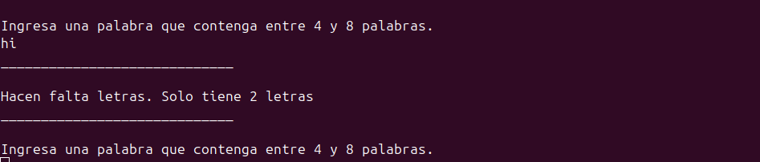

### Mas de 8 palabras.

> 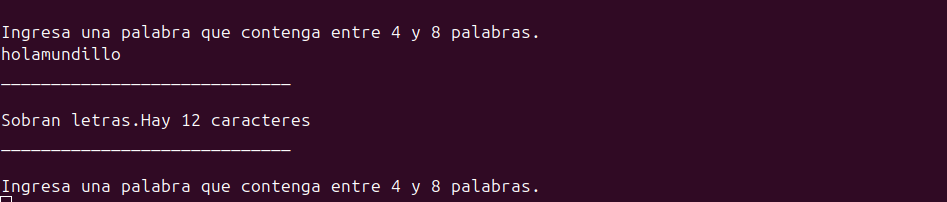

### Ingreso de numeros.

> 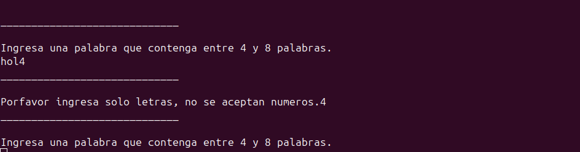

### Salida satisfactoria, numero de letras adecuado.

> 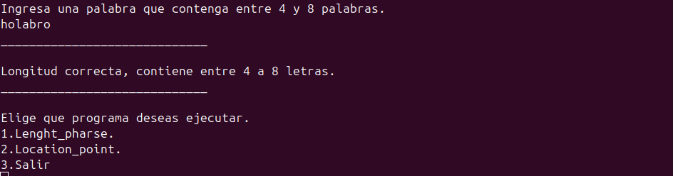

# Encuentra el cuadrante.

### Objetivo.

> Crear un programa que **identifique en que cuadrante se encuentra el punto que ingresa el usuario**, de la misma forma el programa debera **verificar** que el punto ingresado **no se encuentre en la cordena 0**. El programa debe mostrar la coordenada del punto ingresado y el cuadrante al que este pertenece.

### Inicio del programa

> 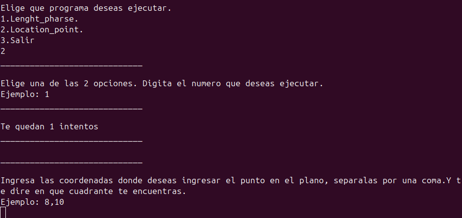

### No se encuentre en la coordenada 0.

> 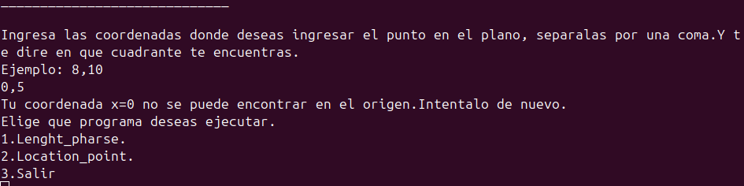

### Identificando el cuadrante donde se encuentra el punto.

> 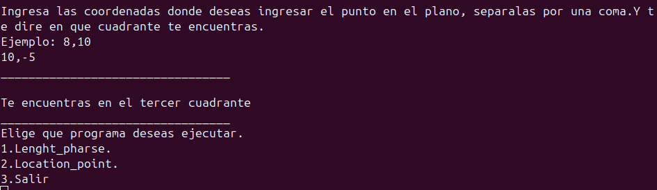

### Extra por si el usuario agrega tres coordenadas

> 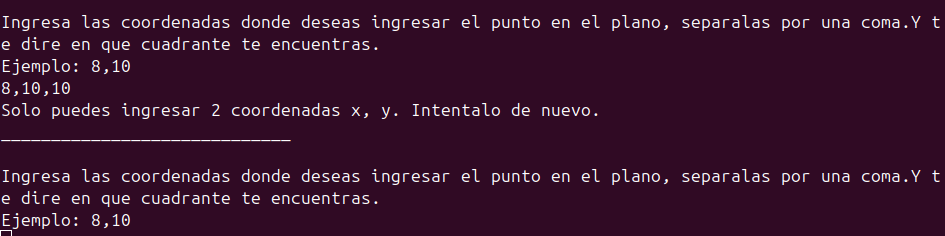

# main.py

> Importa ambas funciones para que puedan ser utilizadas, se agrego para no tener que ejecutar cada uno de forma individual, se encapsulo el proyecto en una funcion para su reutilización, brinda un menu, para que se pueda elegir el programa deseado.

### Menu de inicio.

> 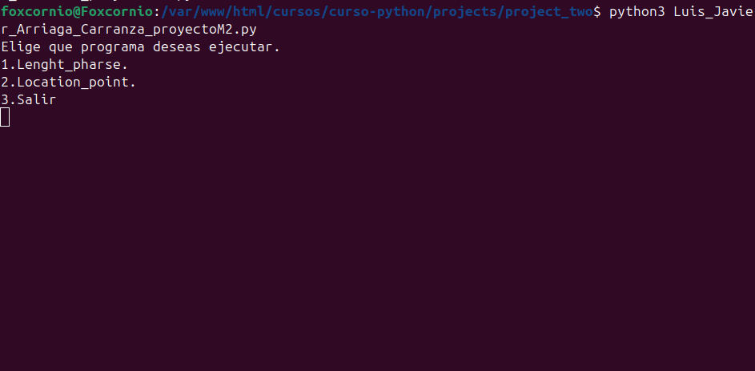

### Si el usuario selecciona una opcion no valida sera notificado y tendra 3 intentos.

> 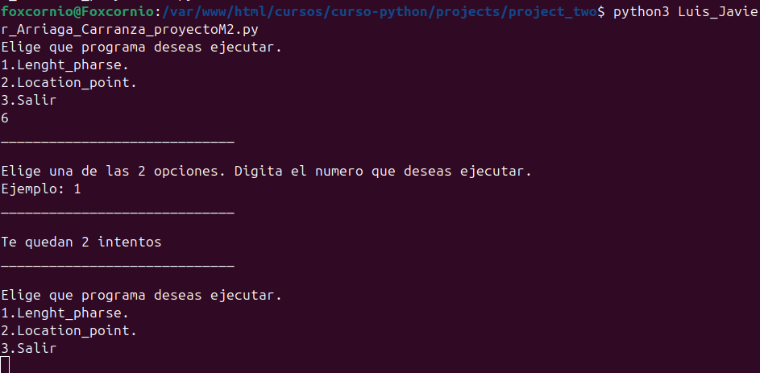

### Impresion de salida al elegir salir

> 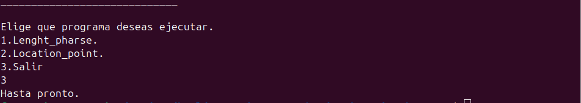

# Conclusiones.

> Esta ocasión aprendí muchas más sobre como utilizar python, además de ponerme a prueba en los ejercicios de cada semana. Implementar el pep8 me ha costado un poco pero creo que lo voy dominando, ademas aprendi una forma de visualizar todas los metodos de los tipos de dato con dir. Hacer los comentarios en ingles creo que me ayudara bastante a comenzar a praticar el idioma así como el escribir mi codigo en este mismo, solo me faltaria comenzar hacerlo con la documentación. Respeto a los temas de las listas, tuplas, conjuntos y diccionarios, me alegra decir que aprendi sus diferencias, investigue por otro medio los conjuntos y me parecieron muy buenos para determinar coincidencias entre datos de una forma sencilla. Aprendí a usar la funcion format de los diccionarios para hacer diccionarios dinamicos, algo que no tenia idea de que fuese posible.
